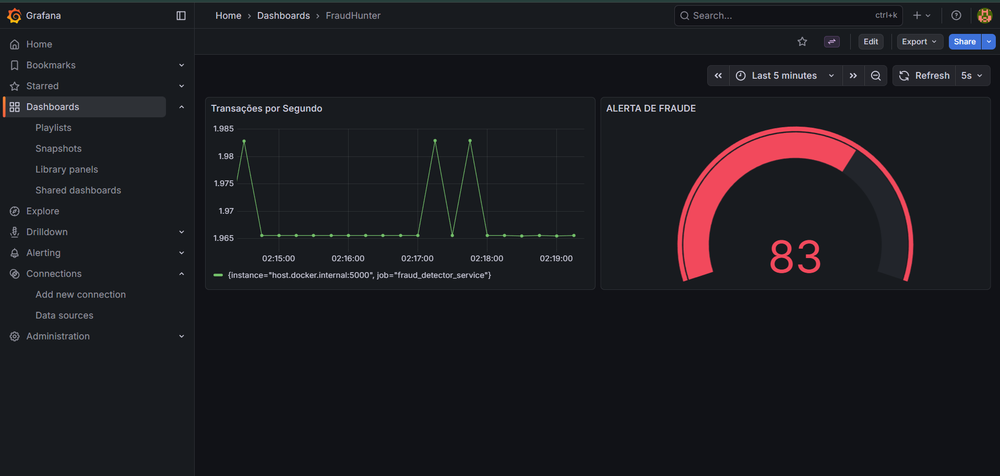
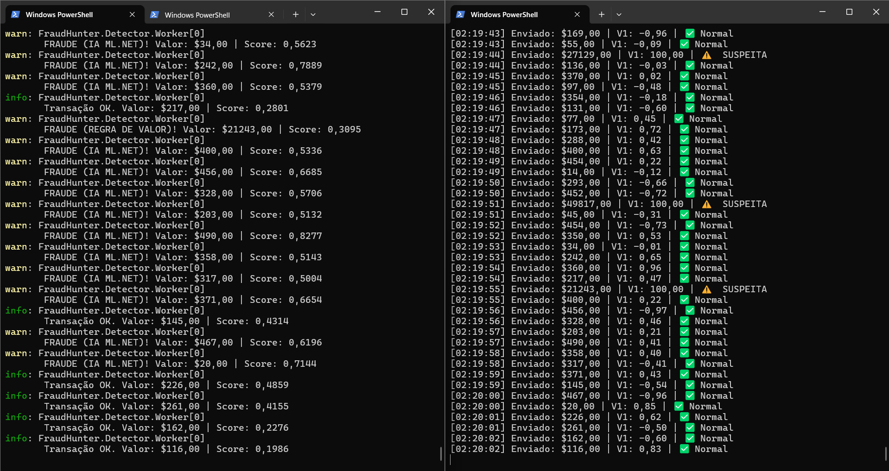

````markdown
# 🕵️‍♂️ FraudHunter - Real Time Fraud System

> Um ecossistema de microsserviços para detecção de anomalias financeiras utilizando **Machine Learning**, **Regras Híbridas** e **Observabilidade**.


---

## 🧠 Sobre o Projeto

O **FraudHunter** simula o ambiente de uma processadora de pagamentos de alta performance. O objetivo é ingerir transações, analisá-las em milissegundos e decidir se são legítimas ou fraudulentas antes de aprová-las.

Diferente de sistemas tradicionais baseados apenas em regras fixas (*hard rules*), este projeto implementa um **Motor de Risco Híbrido**:

1.  **Regras de Negócio (Determinísticas):** Bloqueio imediato de transações que excedem limites de valor pré-estabelecidos.
2.  **Inteligência Artificial (Probabilísticas):** Um modelo de *Anomaly Detection* (baseado em Randomized PCA) treinado com ML.NET analisa 28 variáveis comportamentais anônimas para detectar padrões de fraude invisíveis a regras simples.

## 🏗️ Arquitetura da Solução

O sistema foi desenhado seguindo princípios de **Arquitetura Orientada a Eventos (EDA)**:

```mermaid
graph LR
    A[Producer / Simulador] -- Transações JSON --> B(RabbitMQ Queue)
    B -- Push --> C[Worker Service / Detector]
    C -- Carrega Modelo --> D[(ML.NET Model .zip)]
    C -- Métricas --> E[Prometheus]
    E -- Visualização --> F[Grafana Dashboard]
````

  * **FraudHunter.Producer:** Console App que gera carga de transações sintéticas (normais e anomalias matemáticas) e publica no RabbitMQ.
  * **FraudHunter.Detector:** Worker Service que consome a fila, executa a predição da IA e aplica a lógica de decisão híbrida.
  * **Observabilidade:** Stack Prometheus + Grafana configurada via Docker para monitoramento de TPS (Transações por Segundo) e Alertas de Risco.

-----

## 📦 Estrutura do Projeto

```text
FraudHunter/
├── FraudHunter.Core/       # Modelos e Contratos (Shared Kernel)
├── FraudHunter.Detector/   # Worker Service (Consumidor + IA)
├── FraudHunter.Producer/   # Simulador de Transações (Produtor)
├── FraudHunter.Trainer/    # Console para Treinamento do Modelo ML
├── grafana/                # Configurações de Provisionamento (IaC)
├── docker-compose.yml      # Orquestração da Infraestrutura
└── dashboard.json          # Backup do Dashboard Grafana
```

-----

## 📊 Screenshots

### Dashboard de Monitoramento (Grafana)

Visualização em tempo real da vazão de transações e velocímetro de risco. A infraestrutura utiliza **Provisioning**, subindo configurada automaticamente.

### Detecção Híbrida (Logs do Detector)

O sistema identifica a origem do bloqueio: **IA ML.NET** (comportamento suspeito) ou **REGRA DE VALOR** (montante excessivo).

-----

## 🚀 Como Executar o Projeto

### ⚠️ Importante: Dataset

O dataset utilizado (`creditcard.csv`) excede o limite de tamanho do GitHub. Antes de rodar o treinamento, faça o download dele no Kaggle e coloque na pasta `FraudHunter.Trainer`.
👉 **[Download do Dataset no Kaggle](https://www.kaggle.com/mlg-ulb/creditcardfraud)**

### Pré-requisitos

  * [Docker Desktop](https://www.docker.com/) instalado.
  * [.NET 10 SDK](https://dotnet.microsoft.com/download) instalado.

### 1\. Clonar e Subir a Infraestrutura

Na raiz do projeto, execute o Docker Compose. Isso subirá o RabbitMQ, Prometheus e Grafana já configurados.

```bash
docker-compose up -d
```

### 2\. Iniciar o Detector (Consumidor)

Este serviço ficará aguardando mensagens na fila.

```bash
dotnet run --project FraudHunter.Detector
```

### 3\. Iniciar o Simulador (Produtor)

Em um novo terminal, inicie o gerador de transações.

```bash
dotnet run --project FraudHunter.Producer
```

### 4\. Acessar o Dashboard

  * Acesse: `http://localhost:3000`
  * Login: `admin` / Senha: `admin`
  * Vá em **Dashboards** \> **FraudHunter**.
  * *Dica:* Se os gráficos parecerem vazios, verifique se o "Time Range" do Grafana (canto superior direito) está definido para **"Last 5 minutes"**.

-----

## 🛠️ Tecnologias e Práticas

  * **C\# / .NET 10**: Worker Services e Console Apps de alta performance.
  * **ML.NET (Randomized PCA)**: Detecção de anomalias não supervisionada.
  * **RabbitMQ**: Mensageria para desacoplamento e resiliência.
  * **Prometheus & Grafana**: Monitoramento de métricas customizadas (`prometheus-net`).
  * **Docker Compose**: Orquestração de containers.
  * **Infrastructure as Code (IaC)**: Provisionamento automático de Data Sources e Dashboards do Grafana.

-----

## 👨‍💻 Autor

Desenvolvido por **Everton**

```
```
